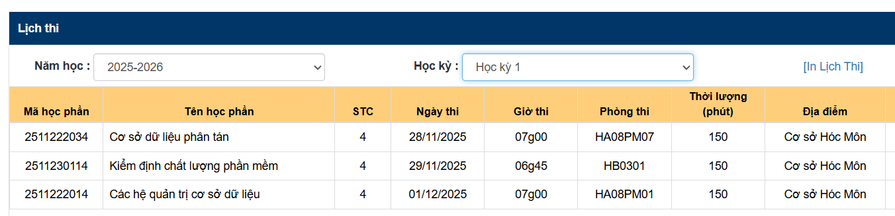
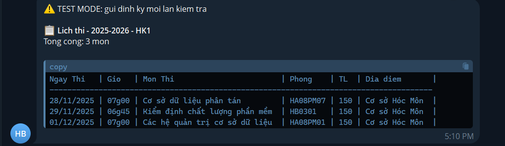

# Bot thông báo lịch thi HUFLIT

Bot tự động kiểm tra lịch thi trên [portal HUFLIT](https://portal.huflit.edu.vn) và gửi thông báo qua Telegram khi có thay đổi.

Do HK2 Năm học 2025-2026 Lịch thi gần cuối tuần 12 mới có với lại nằm lướt Tiktok quá chán,nên tôi quyết định làm tool này để auto gửi lịch thi về telegram thay vì phải lên portal check

## Cài đặt

Yêu cầu **Python 3.10+**.

```bash
pip install -r requirements.txt
playwright install chromium
```

---

## Cấu hình

Tạo `config.json` dựa trên `config.example.json`:

```json
{
  "telegram_bot_token": "YOUR_TELEGRAM_BOT_TOKEN",
  "telegram_chat_id": "YOUR_CHAT_ID",
  "session_state_path": ".auth/huflit_state.json",
  "interactive_login_timeout_seconds": 300,
  "playwright_user_data_dir": ".auth/bot-chrome-profile",
  "playwright_profile_directory": "Default",
  "browser_priority": ["brave", "chrome", "edge"],
  "auth_alert_cooldown_minutes": 60,
  "cookie": "",
  "academic_year": "2025-2026",
  "semester": "HK2",
  "check_interval_minutes": 15,
  "force_notify_every_check": false,
  "portal_url": "https://portal.huflit.edu.vn/Home/Exam"
}
```

### Ý nghĩa các trường

| Trường                              | Mô tả                                            |
| ----------------------------------- | ------------------------------------------------ |
| `telegram_bot_token`                | Token bot Telegram (lấy từ @BotFather)           |
| `telegram_chat_id`                  | Chat ID nhận thông báo (lấy từ @userinfobot)     |
| `session_state_path`                | File lưu session Playwright sau khi đăng nhập    |
| `interactive_login_timeout_seconds` | Thời gian chờ đăng nhập tương tác (giây)         |
| `playwright_user_data_dir`          | Thư mục profile Chrome riêng cho bot             |
| `playwright_profile_directory`      | Tên profile Chrome (`Default`, `Profile 1`, ...) |
| `browser_priority`                  | Thứ tự ưu tiên đọc cookie từ trình duyệt         |
| `auth_alert_cooldown_minutes`       | Khoảng nghỉ giữa các cảnh báo auth (phút)        |
| `cookie`                            | Cookie thủ công (fallback cuối cùng)             |
| `academic_year`                     | Năm học, ví dụ `2025-2026`                       |
| `semester`                          | Học kỳ, ví dụ `HK1`, `HK2`                       |
| `check_interval_minutes`            | Khoảng thời gian giữa mỗi lần kiểm tra (phút)    |
| `force_notify_every_check`          | Gửi thông báo mỗi lần check dù không đổi         |
| `portal_url`                        | URL trang lịch thi trên portal                   |

---

## Lệnh chạy

```bash
# Chạy bot (luôn dùng lệnh này)
python bot.py run

# Tương đương
python bot.py

# Đăng nhập thủ công để lưu session (một lần)
python bot.py login
```

---

## Luồng hoạt động

```
Bot khởi động
    │
    ├── Có session hợp lệ (.auth/huflit_state.json)
    │       └── Dùng session → Kiểm tra lịch thi → Gửi Telegram
    │
    ├── Không có / hết hạn
    │       └── Mở cửa sổ Chrome để đăng nhập Microsoft
    │       └── Bạn đăng nhập + MFA → Bot tự lưu session
    │       └── Tiếp tục kiểm tra lịch thi
    │
    └── Mọi cách đều lỗi
            └── Gửi cảnh báo qua Telegram (có cooldown)
```

---

## Lần đầu sử dụng

1. Chạy `python bot.py login`
2. Cửa sổ Chrome mới hiện ra (profile riêng của bot)
3. Đăng nhập portal HUFLIT → tick **Remember me**
4. Đợi bot tự lưu session (thường vài giây sau khi vào trang chính)
5. Từ lần sau, chạy `python bot.py run` — không cần nhập lại

---

## Xử lý sự cố

| Vấn đề                      | Giải pháp                                                                      |
| --------------------------- | ------------------------------------------------------------------------------ |
| `about:blank` khi mở Chrome | Đóng Chrome thật đang chạy, hoặc dùng profile riêng `.auth/bot-chrome-profile` |
| Cookie browser bị khóa      | Đóng Brave/Chrome/Edge hoàn toàn, hoặc chạy terminal bằng **Administrator**    |
| Session hết hạn             | Chạy lại `python bot.py login` để đăng nhập lại                                |
| Bot không gửi Telegram      | Kiểm tra `telegram_bot_token` và `telegram_chat_id` trong `config.json`        |

## Ảnh chụp lịch thi từ Portal



## Ảnh chụp lịch thi từ Telegram



## Ngoài lề

- Cảm ơn Cursor,Codex,Antigravity
